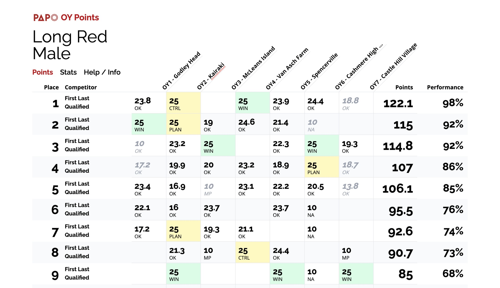
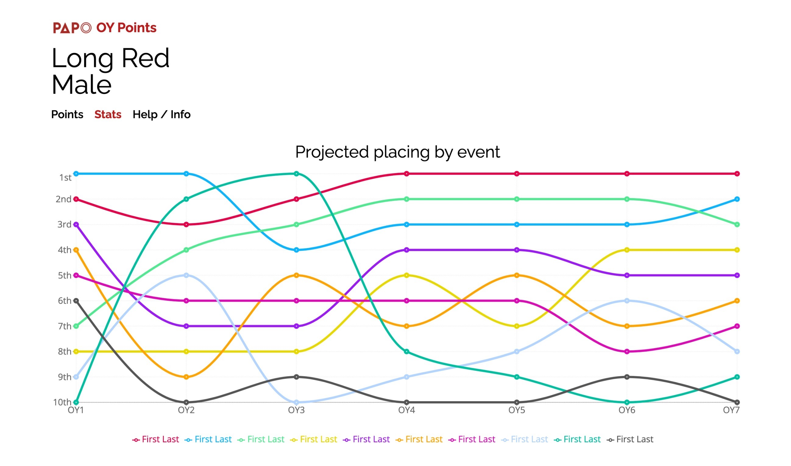

# Orienteer of the Year

## What is OY?

This repo contains the source code for alculating points and placings for [PAPO Orienteering Club](https://papo.org.nz)'s Orienteer of the Year competition.

The competition consists of 5-8 events throughout the year, and club members can earn points in each of them based on their performance in that event. At the end of the year, the orienteer in each category with the most points is crowned the Orienteer of the Year. Rules for points allocation and more information on the competition can be found on the PAPO website [here](https://papo.org.nz/club-info/oy-points-2/).

## Repo structure

This repo contains the [frontend](client) (written with React), which displays points as they are updated throught the year, as well as key graphs and stats about the year.

It also contains the [backend](api), which is written with Express, and the [points calculation scripts](scripts), which are written in Python.

The repo is intended to be used with a MySQL database. The currently used schema can be found in MySQLDump XML format at [database/schema](database/schema).

## Website screenshots

